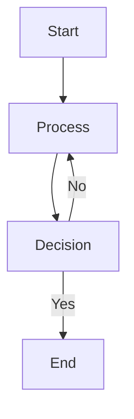
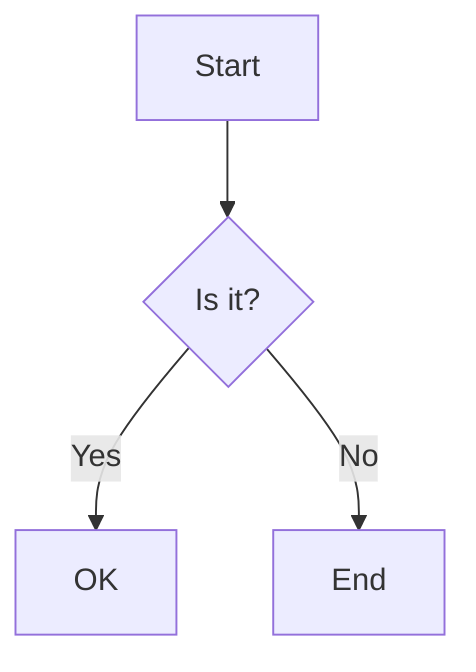
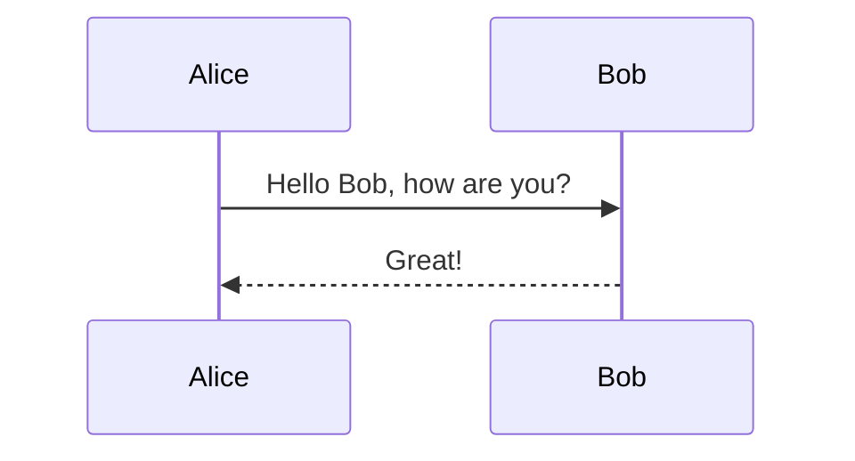
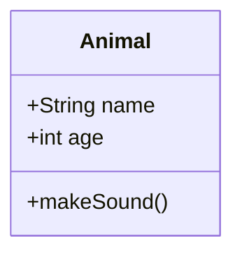
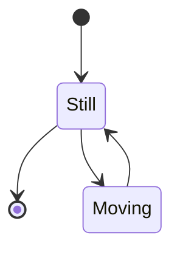
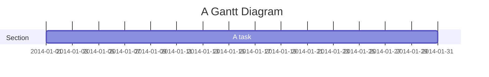
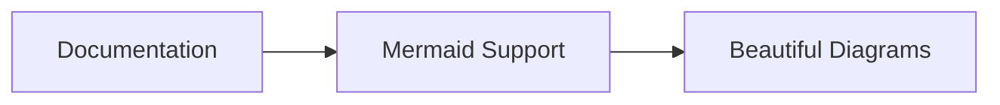

# Mermaid Diagram Support Setup

This document describes how Mermaid diagram support has been implemented in the Celline documentation system.

## Implementation Overview

Mermaid support has been enabled through the following components:

### 1. Package Dependencies

Added to `package.json`:
- `mermaid`: ^11.5.1 - Core Mermaid library
- `rehype-mermaid`: ^3.0.0 - Rehype plugin for processing Mermaid in markdown

### 2. Nuxt Configuration

Updated `nuxt.config.ts`:
```typescript
content: {
  markdown: {
    remarkPlugins: ['remark-math'],
    rehypePlugins: [
      ['rehype-katex', { output: 'html', strict: false }],
      ['rehype-mermaid', { strategy: 'img-svg' }]
    ]
  },
  highlight: {
    preload: ['js','ts','vue','bash', 'python', 'mermaid']
  }
}
```

### 3. Components

#### ProsePre.vue Enhancement
Enhanced the existing `components/content/ProsePre.vue` to:
- Detect Mermaid code blocks (`language-mermaid`)
- Render Mermaid diagrams as SVG
- Maintain existing code block functionality
- Support both light and dark modes
- Provide responsive design

#### Mermaid Plugin
Created `plugins/mermaid.client.ts`:
- Client-side Mermaid initialization
- Global configuration
- Theme support

## Usage

### Basic Syntax

To add a Mermaid diagram to any markdown file:

```markdown

```

### Supported Diagram Types

The implementation supports all Mermaid diagram types:

1. **Flowcharts**


2. **Sequence Diagrams**


3. **Class Diagrams**


4. **State Diagrams**


5. **Gantt Charts**


## Features

### Responsive Design
- Diagrams automatically scale for mobile devices
- Overflow handling for large diagrams
- Proper aspect ratio maintenance

### Dark Mode Support
- Automatic theme switching
- Proper contrast in both light and dark modes
- Filter-based approach for SVG elements

### Error Handling
- Graceful fallback for invalid Mermaid syntax
- Error messages with debugging information
- Fallback to code block display on failure

### Performance
- Client-side rendering to avoid SSR issues
- Dynamic imports to reduce bundle size
- Caching and optimization

## Configuration Options

The Mermaid configuration can be customized in the plugin:

```typescript
mermaid.default.initialize({
  startOnLoad: false,
  theme: 'default',
  securityLevel: 'loose',
  themeVariables: {
    primaryColor: '#3b82f6',
    primaryTextColor: '#1f2937',
    // ... other theme variables
  }
})
```

## Installation Steps

To install the dependencies (run in the project root):

```bash
npm install mermaid rehype-mermaid
```

## Testing

Test the implementation by adding a Mermaid diagram to any markdown file:

```markdown

```

## Troubleshooting

### Common Issues

1. **Diagrams not rendering**: Check browser console for JavaScript errors
2. **Styling issues**: Verify CSS classes are properly loaded
3. **SSR errors**: Ensure client-side only rendering

### Debug Mode

Enable debug logging by adding to the browser console:
```javascript
window.mermaid.setLogLevel('debug')
```

## Examples in Documentation

The custom functions development guide already includes a working example:

```mermaid
graph TD
    A[Function Creation] --> B[Parameter Validation]
    B --> C[CLI Argument Parsing]
    C --> D[Project Context Setup]
    D --> E[call() Method Execution]
    E --> F[Resource Cleanup]
    F --> G[Return Updated Project]
```

This should render as a flowchart showing the function lifecycle.