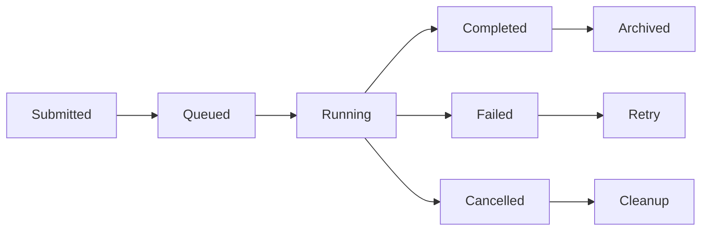

# Job Function

Monitor and manage analysis jobs and computational tasks.

## Overview

The `Job` function provides job management capabilities for Celline projects, allowing users to monitor running analyses, check job status, manage job queues, and handle computational resources. It serves as the central hub for tracking long-running processes and cluster computing tasks.

## Class Information

- **Module**: `celline.functions.job`
- **Class**: `Job`
- **Base Class**: `CellineFunction`

## Parameters

The `Job` function currently takes no constructor parameters. It operates on the current project context to discover and manage jobs.

## Usage Examples

### Python API

#### Basic Job Monitoring

```python
from celline import Project
from celline.functions.job import Job

# Create project
project = Project("./my-project")

# Monitor jobs
job_function = Job()

# Execute function
result = project.call(job_function)
```

#### Programmatic Job Access

```python
from celline import Project
from celline.functions.job import Job

# Create project
project = Project("./my-project")

# Get job information
job_function = Job()
result = job_function.call(project)

# Access job details (when extended)
# job_status = job_function.get_job_status()
# running_jobs = job_function.list_running_jobs()
```

### CLI Usage

#### Basic Usage

```bash
# Display job status
celline run job

# Monitor all jobs
celline job status

# List running jobs
celline job list
```

## Implementation Details

### Current Implementation

The current implementation provides a basic framework:

```python
class Job(CellineFunction):
    def register(self) -> str:
        return "job"

    def call(self, project):
        print("Job management - implement functionality as needed")
        return project
```

### Extended Job Management

Here's how the function could be extended for comprehensive job management:

```python
from dataclasses import dataclass
from typing import List, Dict, Optional
from enum import Enum
import subprocess
import time
import json

class JobStatus(Enum):
    PENDING = "pending"
    RUNNING = "running"
    COMPLETED = "completed"
    FAILED = "failed"
    CANCELLED = "cancelled"

@dataclass
class JobInfo:
    job_id: str
    name: str
    status: JobStatus
    command: str
    start_time: Optional[str]
    end_time: Optional[str]
    log_file: str
    working_dir: str
    resources: Dict[str, str]

class ExtendedJob(CellineFunction):
    def __init__(self):
        self.jobs: Dict[str, JobInfo] = {}
        self.job_history: List[JobInfo] = []
    
    def call(self, project):
        # Display job management interface
        self._display_job_dashboard()
        return project
    
    def _display_job_dashboard(self):
        from rich.table import Table
        from rich.console import Console
        
        console = Console()
        
        # Active jobs table
        table = Table(title="Active Jobs")
        table.add_column("Job ID", style="cyan")
        table.add_column("Name", style="green")
        table.add_column("Status", style="yellow")
        table.add_column("Runtime", style="blue")
        
        for job in self.jobs.values():
            runtime = self._calculate_runtime(job)
            table.add_row(
                job.job_id,
                job.name,
                job.status.value,
                runtime
            )
        
        console.print(table)
```

## Job Types and Management

### Supported Job Types

| Job Type | Description | Typical Duration |
|----------|-------------|------------------|
| **Count** | Cell Ranger processing | 2-8 hours |
| **Preprocess** | Quality control | 10-30 minutes |
| **Prediction** | Cell type classification | 30-60 minutes |
| **Integration** | Multi-sample integration | 1-4 hours |
| **Batch Correction** | Batch effect removal | 2-6 hours |
| **Custom Scripts** | User-defined analyses | Variable |

### Job Lifecycle



### Job Monitoring System

```python
class JobMonitor:
    def __init__(self, project_path):
        self.project_path = project_path
        self.jobs_file = f"{project_path}/.celline/jobs.json"
        self.load_jobs()
    
    def submit_job(self, name: str, command: str, resources: Dict[str, str]) -> str:
        """Submit a new job for execution."""
        job_id = self._generate_job_id()
        
        job = JobInfo(
            job_id=job_id,
            name=name,
            status=JobStatus.PENDING,
            command=command,
            start_time=None,
            end_time=None,
            log_file=f"logs/{job_id}.log",
            working_dir=self.project_path,
            resources=resources
        )
        
        self.jobs[job_id] = job
        self.save_jobs()
        
        # Start job execution
        self._execute_job(job)
        
        return job_id
    
    def get_job_status(self, job_id: str) -> Optional[JobStatus]:
        """Get status of specific job."""
        if job_id in self.jobs:
            return self.jobs[job_id].status
        return None
    
    def list_jobs(self, status_filter: Optional[JobStatus] = None) -> List[JobInfo]:
        """List jobs with optional status filter."""
        if status_filter:
            return [job for job in self.jobs.values() if job.status == status_filter]
        return list(self.jobs.values())
    
    def cancel_job(self, job_id: str) -> bool:
        """Cancel a running job."""
        if job_id in self.jobs:
            job = self.jobs[job_id]
            if job.status == JobStatus.RUNNING:
                # Kill the process
                self._kill_job_process(job_id)
                job.status = JobStatus.CANCELLED
                job.end_time = time.strftime("%Y-%m-%d %H:%M:%S")
                self.save_jobs()
                return True
        return False
```

## Cluster Integration

### PBS/Torque Integration

```python
class PBSJobManager:
    def submit_pbs_job(self, script_path: str, resources: Dict[str, str]) -> str:
        """Submit job to PBS cluster."""
        
        pbs_script = f"""#!/bin/bash
#PBS -N {resources.get('job_name', 'celline_job')}
#PBS -l nodes={resources.get('nodes', '1')}:ppn={resources.get('ppn', '8')}
#PBS -l mem={resources.get('memory', '32gb')}
#PBS -l walltime={resources.get('walltime', '24:00:00')}
#PBS -o {resources.get('output_file', 'job.out')}
#PBS -e {resources.get('error_file', 'job.err')}

cd $PBS_O_WORKDIR
{script_path}
"""
        
        # Write PBS script
        pbs_file = f"job_{int(time.time())}.pbs"
        with open(pbs_file, 'w') as f:
            f.write(pbs_script)
        
        # Submit to queue
        result = subprocess.run(['qsub', pbs_file], capture_output=True, text=True)
        
        if result.returncode == 0:
            job_id = result.stdout.strip()
            return job_id
        else:
            raise RuntimeError(f"Job submission failed: {result.stderr}")
    
    def check_pbs_status(self, job_id: str) -> JobStatus:
        """Check PBS job status."""
        result = subprocess.run(['qstat', job_id], capture_output=True, text=True)
        
        if result.returncode == 0:
            # Parse qstat output
            lines = result.stdout.strip().split('\n')
            if len(lines) > 2:
                status_line = lines[2]
                status_char = status_line.split()[4]
                
                status_map = {
                    'Q': JobStatus.PENDING,
                    'R': JobStatus.RUNNING,
                    'C': JobStatus.COMPLETED,
                    'E': JobStatus.FAILED
                }
                
                return status_map.get(status_char, JobStatus.PENDING)
        
        return JobStatus.FAILED
```

### SLURM Integration

```python
class SLURMJobManager:
    def submit_slurm_job(self, script_path: str, resources: Dict[str, str]) -> str:
        """Submit job to SLURM cluster."""
        
        slurm_script = f"""#!/bin/bash
#SBATCH --job-name={resources.get('job_name', 'celline_job')}
#SBATCH --nodes={resources.get('nodes', '1')}
#SBATCH --ntasks-per-node={resources.get('ntasks', '8')}
#SBATCH --mem={resources.get('memory', '32G')}
#SBATCH --time={resources.get('time', '24:00:00')}
#SBATCH --output={resources.get('output_file', 'job.out')}
#SBATCH --error={resources.get('error_file', 'job.err')}

{script_path}
"""
        
        # Write SLURM script
        slurm_file = f"job_{int(time.time())}.slurm"
        with open(slurm_file, 'w') as f:
            f.write(slurm_script)
        
        # Submit to queue
        result = subprocess.run(['sbatch', slurm_file], capture_output=True, text=True)
        
        if result.returncode == 0:
            job_id = result.stdout.split()[-1]
            return job_id
        else:
            raise RuntimeError(f"Job submission failed: {result.stderr}")
    
    def check_slurm_status(self, job_id: str) -> JobStatus:
        """Check SLURM job status."""
        result = subprocess.run(['squeue', '-j', job_id], capture_output=True, text=True)
        
        if result.returncode == 0:
            lines = result.stdout.strip().split('\n')
            if len(lines) > 1:
                status_line = lines[1]
                status = status_line.split()[4]
                
                status_map = {
                    'PD': JobStatus.PENDING,
                    'R': JobStatus.RUNNING,
                    'CD': JobStatus.COMPLETED,
                    'F': JobStatus.FAILED,
                    'CA': JobStatus.CANCELLED
                }
                
                return status_map.get(status, JobStatus.PENDING)
        
        return JobStatus.COMPLETED  # Job not in queue, assume completed
```

## Job Persistence

### Job Database

```python
import sqlite3
from typing import List

class JobDatabase:
    def __init__(self, db_path: str):
        self.db_path = db_path
        self.init_database()
    
    def init_database(self):
        """Initialize job database schema."""
        conn = sqlite3.connect(self.db_path)
        cursor = conn.cursor()
        
        cursor.execute("""
            CREATE TABLE IF NOT EXISTS jobs (
                job_id TEXT PRIMARY KEY,
                name TEXT NOT NULL,
                status TEXT NOT NULL,
                command TEXT NOT NULL,
                start_time TEXT,
                end_time TEXT,
                log_file TEXT,
                working_dir TEXT,
                resources TEXT,
                created_at TEXT DEFAULT CURRENT_TIMESTAMP
            )
        """)
        
        conn.commit()
        conn.close()
    
    def save_job(self, job: JobInfo):
        """Save job to database."""
        conn = sqlite3.connect(self.db_path)
        cursor = conn.cursor()
        
        cursor.execute("""
            INSERT OR REPLACE INTO jobs 
            (job_id, name, status, command, start_time, end_time, log_file, working_dir, resources)
            VALUES (?, ?, ?, ?, ?, ?, ?, ?, ?)
        """, (
            job.job_id,
            job.name,
            job.status.value,
            job.command,
            job.start_time,
            job.end_time,
            job.log_file,
            job.working_dir,
            json.dumps(job.resources)
        ))
        
        conn.commit()
        conn.close()
    
    def load_jobs(self) -> List[JobInfo]:
        """Load all jobs from database."""
        conn = sqlite3.connect(self.db_path)
        cursor = conn.cursor()
        
        cursor.execute("SELECT * FROM jobs ORDER BY created_at DESC")
        rows = cursor.fetchall()
        
        jobs = []
        for row in rows:
            job = JobInfo(
                job_id=row[0],
                name=row[1],
                status=JobStatus(row[2]),
                command=row[3],
                start_time=row[4],
                end_time=row[5],
                log_file=row[6],
                working_dir=row[7],
                resources=json.loads(row[8])
            )
            jobs.append(job)
        
        conn.close()
        return jobs
```

## Real-time Monitoring

### Log Streaming

```python
import asyncio
import websockets
import json

class LogStreamer:
    def __init__(self, job_id: str, log_file: str):
        self.job_id = job_id
        self.log_file = log_file
        self.clients = set()
    
    async def register_client(self, websocket):
        """Register client for log streaming."""
        self.clients.add(websocket)
        try:
            await websocket.wait_closed()
        finally:
            self.clients.remove(websocket)
    
    async def stream_logs(self):
        """Stream log file updates to clients."""
        try:
            with open(self.log_file, 'r') as f:
                # Send existing content
                content = f.read()
                if content:
                    await self.broadcast_log(content)
                
                # Monitor for new content
                while True:
                    new_content = f.read()
                    if new_content:
                        await self.broadcast_log(new_content)
                    await asyncio.sleep(1)
                    
        except FileNotFoundError:
            await self.broadcast_log(f"Log file not found: {self.log_file}")
    
    async def broadcast_log(self, content: str):
        """Broadcast log content to all clients."""
        if self.clients:
            message = json.dumps({
                'job_id': self.job_id,
                'type': 'log',
                'content': content
            })
            
            disconnected = set()
            for client in self.clients:
                try:
                    await client.send(message)
                except websockets.exceptions.ConnectionClosed:
                    disconnected.add(client)
            
            # Remove disconnected clients
            self.clients -= disconnected
```

### Progress Tracking

```python
class ProgressTracker:
    def __init__(self, job_id: str):
        self.job_id = job_id
        self.progress = 0.0
        self.stage = "Initializing"
        self.details = {}
    
    def update_progress(self, progress: float, stage: str, details: Dict = None):
        """Update job progress."""
        self.progress = min(100.0, max(0.0, progress))
        self.stage = stage
        if details:
            self.details.update(details)
        
        # Broadcast update
        self._broadcast_progress()
    
    def _broadcast_progress(self):
        """Broadcast progress to monitoring systems."""
        progress_data = {
            'job_id': self.job_id,
            'progress': self.progress,
            'stage': self.stage,
            'details': self.details,
            'timestamp': time.time()
        }
        
        # Send to websocket clients, file system, etc.
        self._save_progress(progress_data)
    
    def _save_progress(self, data: Dict):
        """Save progress to file for persistence."""
        progress_file = f"logs/{self.job_id}_progress.json"
        with open(progress_file, 'w') as f:
            json.dump(data, f, indent=2)
```

## Methods

### `register() -> str`

Returns the function identifier for registration.

### `call(project: Project) -> Project`

Main execution method that displays job management interface.

**Parameters**:
- `project`: The Celline project instance

**Returns**: Updated project instance

**Current behavior**: Prints placeholder message

## Future Enhancements

### Planned Features

1. **Job Queue Management**: Submit, monitor, and manage job queues
2. **Resource Monitoring**: Track CPU, memory, and storage usage
3. **Cluster Integration**: Full PBS/SLURM support
4. **Job Dependencies**: Define job execution dependencies
5. **Automatic Retries**: Retry failed jobs with backoff
6. **Job Notifications**: Email/webhook notifications for job completion
7. **Performance Analytics**: Job performance analysis and optimization

### Enhanced CLI Interface

```bash
# Job management commands
celline job list                    # List all jobs
celline job status JOB_ID          # Check specific job status
celline job logs JOB_ID            # View job logs
celline job cancel JOB_ID          # Cancel running job
celline job retry JOB_ID           # Retry failed job
celline job submit SCRIPT          # Submit custom job
celline job queue                  # Show job queue status
celline job history                # Show job history
```

### Web Interface Integration

```typescript
// Job management API for web interface
interface JobAPI {
  listJobs(status?: JobStatus): Promise<JobInfo[]>
  getJob(jobId: string): Promise<JobInfo>
  cancelJob(jobId: string): Promise<boolean>
  retryJob(jobId: string): Promise<string>
  streamLogs(jobId: string): WebSocket
  getProgress(jobId: string): Promise<ProgressInfo>
}
```

## Related Functions

- [Interactive](interactive) - Web interface for visual job monitoring
- [Info](info) - Display project and job information
- [Bash](bash) - Execute custom commands as jobs
- All analysis functions - Generate and manage computational jobs

## Troubleshooting

### Common Issues

1. **Job Tracking**: Jobs not appearing in monitoring system
2. **Log Access**: Cannot read job log files
3. **Status Updates**: Job status not updating correctly
4. **Resource Limits**: Jobs failing due to resource constraints
5. **Cluster Connectivity**: Cannot connect to cluster scheduler

### Debug Mode

Enable detailed job debugging:

```python
import logging

# Enable job debugging
logging.basicConfig(level=logging.DEBUG)
job_logger = logging.getLogger('celline.job')
job_logger.setLevel(logging.DEBUG)
```

### Manual Job Management

For troubleshooting, manage jobs manually:

```bash
# Check cluster jobs directly
qstat -u $USER        # PBS
squeue -u $USER       # SLURM

# Monitor system resources
htop
iostat 1
df -h

# Check log files
tail -f logs/*.log
grep -i error logs/*.log
```