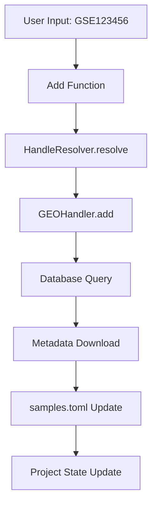
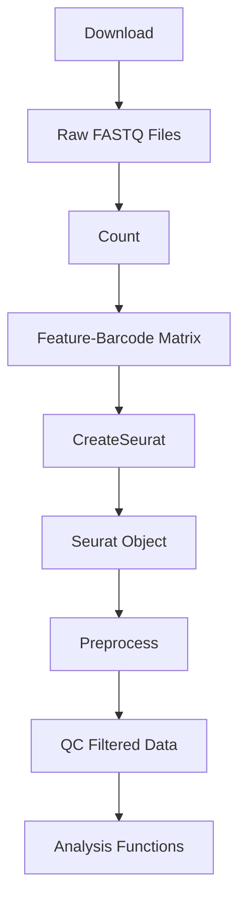

# Architecture

This document provides a detailed explanation of Celline's system architecture and design patterns.
Understanding the codebase structure, data flow, and extensibility enables effective usage and development.

## 🏗️ Architecture Overview

Celline adopts a **modular architecture** and consists of the following main components:

```
┌─────────────────────────────────────────────────────┐
│                 Celline Architecture                │
├─────────────────────────────────────────────────────┤
│ ┌─CLI Layer─────┐ ┌─Web UI─────┐ ┌─Python API─────┐ │
│ │ Rich CLI      │ │ Vue.js     │ │ Direct Import  │ │
│ │ Inquirer      │ │ Nuxt.js    │ │ Jupyter        │ │
│ └───────────────┘ └────────────┘ └────────────────┘ │
├─────────────────────────────────────────────────────┤
│ ┌─API Gateway──────────────────────────────────────┐ │
│ │ FastAPI Server │ REST Endpoints │ WebSocket      │ │
│ └──────────────────────────────────────────────────┘ │
├─────────────────────────────────────────────────────┤
│ ┌─Core Engine──────────────────────────────────────┐ │
│ │ ┌─Project─┐ ┌─Function─┐ ┌─Database─┐ ┌─Utils─┐  │ │
│ │ │Manager  │ │Framework │ │ Layer    │ │Package │ │ │
│ │ └─────────┘ └──────────┘ └──────────┘ └───────┘  │ │
│ └──────────────────────────────────────────────────┘ │
├─────────────────────────────────────────────────────┤
│ ┌─Execution Layer─────────────────────────────────────┐│
│ │ ┌─Threading─┐ ┌─PBS/Slurm─┐ ┌─Container─┐ ┌─R/Shell─┐││
│ │ │ Manager   │ │ Scheduler │ │ Runtime   │ │ Wrapper │││
│ │ └───────────┘ └───────────┘ └───────────┘ └─────────┘││
│ └─────────────────────────────────────────────────────┘│
├─────────────────────────────────────────────────────┤
│ ┌─Data Layer──────────────────────────────────────────┐│
│ │ ┌─Local DB─┐ ┌─File System─┐ ┌─External APIs─────┐ ││
│ │ │ Parquet  │ │ HDF5/H5AD   │ │ GEO │ SRA │ CNCB │ ││
│ │ └──────────┘ └─────────────┘ └───────────────────┘ ││
│ └─────────────────────────────────────────────────────┘│
└─────────────────────────────────────────────────────┘
```

## 🎯 Design Principles

### 1. Modularity

Each component maintains independence and has clear responsibilities.

```python
# Each module provides independent functionality
from celline.functions import Add, Download, Preprocess
from celline.database import SRA_GSM, GEOHandler
from celline.middleware import ThreadObservable
from celline.server import ServerSystem
```

### 2. Extensibility

New features can be easily added through the design.

```python
# Adding custom functions
class CustomAnalysis(CellineFunction):
    def call(self, project):
        # Custom logic
        return project

# Automatic registration
registry.register_function("custom_analysis", CustomAnalysis)
```

### 3. Configuration-Driven

Behavior is controlled by configuration files and can be adjusted according to environment.

```toml
[execution]
system = "PBS"
nthread = 32

[database]
cache_size = "10GB"
sync_interval = 3600
```

### 4. Robustness

Error handling and recovery functions ensure stable execution.

```python
try:
    project.call(function)
except CellineException as e:
    recovery_manager.handle_error(e)
    recovery_manager.resume_from_checkpoint()
```

## 📦 Component Details

### Core Engine

#### Project Manager

Responsible for project lifecycle management.

```python
class Project:
    """
    Central class for Project management
    
    Responsibilities:
    - Loading and managing configuration files
    - Initializing execution environment
    - Controlling function execution
    - Resource management
    """
    
    def __init__(self, project_dir: str, proj_name: str = ""):
        self.PROJ_PATH = project_dir
        self._load_configuration()
        self._setup_execution_environment()
    
    def call(self, func: CellineFunction):
        """Function execution control"""
        return self._execute_with_monitoring(func)
```

#### Function Framework

The framework that serves as the foundation for all analysis functions.

```python
# Function framework hierarchy
CellineFunction (Abstract Base)
├── DataManagement
│   ├── Add
│   ├── Download
│   └── SyncDB
├── DataProcessing  
│   ├── Count
│   ├── Preprocess
│   └── CreateSeurat
└── Analysis
    ├── PredictCelltype
    ├── Reduce
    └── Integrate
```

**Framework Features:**

1. **Unified Interface**: All functions implement the same `call(project)` method
2. **CLI Integration**: Automatic CLI argument parsing and help generation
3. **Parallelization Support**: Automatic parallel execution control
4. **Error Handling**: Unified error handling mechanism

```python
class CellineFunction(ABC):
    @abstractmethod
    def call(self, project: "Project"):
        """Main processing (required implementation)"""
        pass
    
    def cli(self, project: "Project", args: Optional[argparse.Namespace] = None):
        """CLI execution (optional)"""
        return self.call(project)
    
    def add_cli_args(self, parser: argparse.ArgumentParser):
        """CLI argument definition (optional)"""
        pass
```

### Database Layer

#### Database Structure

```python
# Database schema
Database/
├── CNCB_PRJCA.parquet    # CNCB project information
├── SRA_GSE.parquet       # GEO study information
├── SRA_GSM.parquet       # GEO sample information
├── SRA_SRR.parquet       # SRA run information
└── Transcriptome.parquet # Transcriptome reference
```

#### Model Classes

```python
from celline.DB.model import SRA_GSM, SRA_GSE, SRA_SRR

# Database access abstraction
class DatabaseModel:
    def search(self, key: str) -> Schema:
        """Search by primary key"""
        pass
    
    def filter(self, **conditions) -> List[Schema]:
        """Filter by conditions"""
        pass
    
    def update(self, key: str, data: dict):
        """Update record"""
        pass
```

#### Handler System

```python
class HandleResolver:
    """Resolve appropriate handler from sample ID"""
    
    @staticmethod
    def resolve(sample_id: str) -> Optional[DatabaseHandler]:
        if sample_id.startswith("GSE"):
            return GEOHandler()
        elif sample_id.startswith("SRR"):
            return SRAHandler()
        elif sample_id.startswith("CRA"):
            return CNCBHandler()
        return None
```

### Execution Layer

#### Thread Management

```python
class ThreadObservable:
    """Control and monitoring of parallel execution"""
    
    @classmethod
    def set_jobs(cls, njobs: int):
        """Set parallelism"""
        cls.njobs = njobs
    
    @classmethod  
    def call_shell(cls, shell_files: List[str]):
        """Parallel execution of shell scripts"""
        with ThreadPoolExecutor(max_workers=cls.njobs) as executor:
            futures = [executor.submit(cls._execute_shell, f) for f in shell_files]
            return futures
```

#### Cluster Execution

```python
class ServerSystem:
    """Execution environment abstraction"""
    
    @staticmethod
    def usePBS(cluster_name: str):
        """Execution on PBS cluster"""
        cls.current_system = "PBS"
        cls.cluster_server_name = cluster_name
    
    @staticmethod
    def useMultiThreading():
        """Multithreaded execution"""
        cls.current_system = "multithreading"
```

### Web Interface Architecture

#### FastAPI Backend

```python
# API structure
app = FastAPI()

@app.get("/api/project")
async def get_project_info():
    """Get project information"""
    pass

@app.post("/api/samples/add")  
async def add_samples(request: AddSampleRequest):
    """Add samples (asynchronous)"""
    job_id = create_background_job(add_samples_task, request.sample_ids)
    return {"job_id": job_id}

@app.websocket("/ws")
async def websocket_endpoint(websocket: WebSocket):
    """Real-time communication"""
    await websocket.accept()
    # Job status distribution
```

#### Vue.js Frontend

```javascript
// Component structure
App.vue
├── NavigationBar.vue
├── ProjectOverview.vue
├── SampleManager.vue
│   ├── SampleList.vue
│   ├── SampleCard.vue
│   └── AddSampleModal.vue
├── FunctionPanel.vue
│   ├── FunctionList.vue
│   └── FunctionExecutor.vue
└── VisualizationPanel.vue
    ├── QCPlots.vue
    ├── UMAPPlot.vue
    └── ExpressionViewer.vue
```

## 🔄 Data Flow

### 1. Sample Addition Flow



### 2. Data Processing Flow



### 3. Execution Control Flow

```python
def execution_flow():
    """Execution control flow"""
    
    # 1. Load configuration
    config = load_project_config()
    
    # 2. Initialize execution environment
    setup_execution_environment(config)
    
    # 3. Execute functions
    for function in execution_queue:
        # Check prerequisites
        if check_prerequisites(function):
            # Parallel execution control
            if can_parallelize(function):
                execute_parallel(function)
            else:
                execute_sequential(function)
        else:
            log_skipped(function)
    
    # 4. Post-processing
    cleanup_resources()
```

## 🔌 Extension Points

### 1. Adding Custom Functions

```python
# Creating new analysis functions
class CustomCellTypeAnalysis(CellineFunction):
    def __init__(self, method: str = "custom_ml"):
        self.method = method
    
    def call(self, project):
        # Custom analysis logic
        for sample_id in project.get_samples():
            data = project.load_sample_data(sample_id)
            result = self.perform_analysis(data)
            project.save_result(sample_id, result)
        return project
    
    def perform_analysis(self, data):
        # Custom analysis method
        pass

# Function registration
registry.register_function("custom_celltype", CustomCellTypeAnalysis)
```

### 2. Adding New Databases

```python
# New database handler
class CustomDBHandler(DatabaseHandler):
    def __init__(self):
        self.api_endpoint = "https://api.customdb.org"
    
    def can_handle(self, sample_id: str) -> bool:
        return sample_id.startswith("CUSTOM")
    
    def fetch_metadata(self, sample_id: str) -> dict:
        # Fetch metadata from custom API
        pass
    
    def download_data(self, sample_id: str) -> str:
        # Data download
        pass

# Handler registration
HandleResolver.register_handler(CustomDBHandler())
```

### 3. Adding New Execution Environments

```python
class KubernetesExecutor(ExecutionBackend):
    def __init__(self, namespace: str = "default"):
        self.namespace = namespace
    
    def submit_job(self, job_spec: dict) -> str:
        # Submit Kubernetes job
        pass
    
    def monitor_job(self, job_id: str) -> JobStatus:
        # Job monitoring
        pass

# Register as execution environment
ServerSystem.register_backend("kubernetes", KubernetesExecutor)
```

## 🔧 Design Patterns

### 1. Factory Pattern

```python
class FunctionFactory:
    """Function instance creation"""
    
    _registry = {}
    
    @classmethod
    def create(cls, function_name: str, **kwargs) -> CellineFunction:
        if function_name in cls._registry:
            function_class = cls._registry[function_name]
            return function_class(**kwargs)
        raise ValueError(f"Unknown function: {function_name}")
    
    @classmethod
    def register(cls, name: str, function_class: type):
        cls._registry[name] = function_class
```

### 2. Observer Pattern

```python
class JobObserver:
    """Job execution monitoring"""
    
    def __init__(self):
        self.observers = []
    
    def attach(self, observer):
        self.observers.append(observer)
    
    def notify(self, event: JobEvent):
        for observer in self.observers:
            observer.update(event)

# WebSocket notification
class WebSocketNotifier:
    def update(self, event: JobEvent):
        websocket.send_json(event.to_dict())
```

### 3. Command Pattern

```python
class CommandQueue:
    """Command execution control"""
    
    def __init__(self):
        self.queue = []
        self.history = []
    
    def execute(self, command: Command):
        result = command.execute()
        self.history.append(command)
        return result
    
    def undo(self):
        if self.history:
            command = self.history.pop()
            command.undo()
```

## 📊 Performance Considerations

### 1. Memory Management

```python
class MemoryManager:
    """Memory usage monitoring and control"""
    
    def __init__(self, max_memory: str = "8GB"):
        self.max_memory = self._parse_memory(max_memory)
        self.current_usage = 0
    
    def allocate(self, size: int) -> bool:
        if self.current_usage + size <= self.max_memory:
            self.current_usage += size
            return True
        return False
    
    def cleanup(self):
        gc.collect()
        self.current_usage = psutil.Process().memory_info().rss
```

### 2. Parallel Processing Optimization

```python
class ParallelismManager:
    """Parallel processing optimization"""
    
    @staticmethod
    def optimal_thread_count(task_type: str) -> int:
        cpu_count = os.cpu_count()
        
        if task_type == "io_bound":
            return min(cpu_count * 2, 32)
        elif task_type == "cpu_bound":
            return cpu_count
        elif task_type == "memory_bound":
            return max(1, cpu_count // 2)
        
        return cpu_count
```

### 3. Cache Strategy

```python
class CacheManager:
    """Data cache management"""
    
    def __init__(self, cache_dir: str, max_size: str = "10GB"):
        self.cache_dir = Path(cache_dir)
        self.max_size = self._parse_size(max_size)
    
    def get(self, key: str) -> Optional[Any]:
        cache_file = self.cache_dir / f"{key}.pkl"
        if cache_file.exists():
            return pickle.load(cache_file.open('rb'))
        return None
    
    def set(self, key: str, value: Any):
        if self._check_space():
            cache_file = self.cache_dir / f"{key}.pkl"
            pickle.dump(value, cache_file.open('wb'))
```

---

> **Info**: For detailed implementation examples of the architecture, see the [Developer Guide](/celline/development) for more specific development methods.